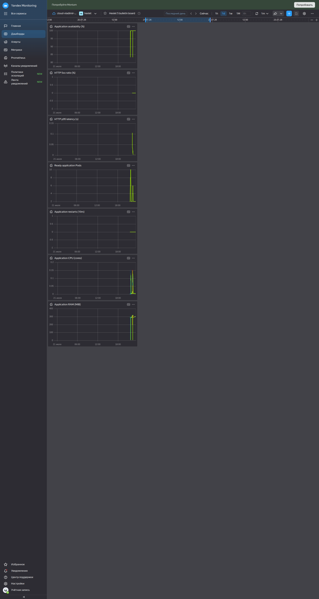

# Bulletin board on Kubernetes

[](https://github.com/autobol4ik/devops-engineer-from-scratch-project-319/actions)
[](https://github.com/autobol4ik/devops-engineer-from-scratch-project-319/actions/workflows/ci.yml)

Live application: [http://51.250.37.85](http://51.250.37.85)

The application runs in Yandex Managed Service for Kubernetes. Terraform
provisions the network, two-stage worker capacity, Managed PostgreSQL, Object
Storage, Lockbox, Cloud Logging and workload identities. Raw Kubernetes
manifests represent the initial deployment; the production source of truth is
the Helm chart.

## Prerequisites

- Docker and access to Docker Hub as `autobol4ik`;
- GNU Make;
- Terraform 1.8 or newer;
- an authenticated Yandex Cloud CLI profile with access to the target cloud
  and folder;
- `kubectl` 1.34 and Helm 3.18;
- `curl` and `jq` for Managed Prometheus configuration;
- AWS-compatible backend credentials generated by the Terraform bootstrap
  root.

JDK and Node.js are included in the multi-stage Docker build. Local application
development can still use the inherited `make test`, `make run`, `make build`
and `make lint` targets.

## Container image

Build the image under a full Git SHA, authenticate and publish the immutable
tag plus `latest`:

```bash
export IMAGE_TAG="$(git rev-parse HEAD)"
make docker-build IMAGE_TAG="$IMAGE_TAG"
make docker-login
make docker-push IMAGE_TAG="$IMAGE_TAG"
```

The resulting image is
`autobol4ik/hexlet-5-bulletin-board:<full-git-sha>`. The runtime stage uses
JRE 21 and an unprivileged UID.

## Terraform infrastructure

Create local configuration files. They are intentionally ignored; the
`*.example` files and provider lock files are tracked.

```bash
cp terraform/bootstrap/terraform.tfvars.example terraform/bootstrap/terraform.tfvars
cp terraform/backend.hcl.example terraform/backend.hcl
cp terraform/terraform.tfvars.example terraform/terraform.tfvars
chmod 600 terraform/bootstrap/terraform.tfvars terraform/backend.hcl terraform/terraform.tfvars
export YC_TOKEN="$(yc iam create-token)"
```

Bootstrap the private versioned state bucket and its dedicated service account:

```bash
make terraform-bootstrap-plan
make terraform-bootstrap-apply
TF_DATA_DIR=/tmp/hexlet-5-terraform/bootstrap \
  terraform -chdir=terraform/bootstrap output -raw state_bucket_name
```

Put the returned bucket name into `terraform/backend.hcl`. Export the backend
credentials without writing them to the repository:

```bash
export AWS_ACCESS_KEY_ID="$(TF_DATA_DIR=/tmp/hexlet-5-terraform/bootstrap terraform -chdir=terraform/bootstrap output -raw backend_access_key)"
export AWS_SECRET_ACCESS_KEY="$(TF_DATA_DIR=/tmp/hexlet-5-terraform/bootstrap terraform -chdir=terraform/bootstrap output -raw backend_secret_key)"
```

Validate and create the initial one-worker environment:

```bash
make terraform-validate
make terraform-plan
make terraform-apply
```

Stage 4 scales the same node group to two workers:

```bash
make terraform-scale-plan
make terraform-scale-apply
```

The main state stays in the S3 backend and must never be committed. Important
outputs include the cluster and node-group IDs, kubeconfig command, PostgreSQL
connection, application S3 credentials, Lockbox ID, security groups, log group
and workload identities.

Create an isolated kubeconfig and record its exact context:

```bash
make kubeconfig KUBECONFIG=/tmp/hexlet-5-kubeconfig
export KUBECONFIG=/tmp/hexlet-5-kubeconfig
export EXPECTED_CONTEXT="$(kubectl config current-context)"
```

## Raw Kubernetes deployment and scaling

The `k8s/raw` directory contains Namespace, ConfigMap, empty Secret example,
Deployment and Services. The Deployment uses RollingUpdate, resource
requests/limits and Actuator readiness/liveness probes. The raw and scaled
manifests reproduce the required initial deployment stages; Helm is the only
production source of truth after the chart is adopted.

For the initial raw stage, create a local `.env` with the following keys:

```dotenv
SPRING_DATASOURCE_URL=
SPRING_DATASOURCE_USERNAME=
SPRING_DATASOURCE_PASSWORD=
STORAGE_S3_BUCKET=
STORAGE_S3_ACCESSKEY=
STORAGE_S3_SECRETKEY=
```

The file is ignored by Git and Docker. Protect it and deploy one replica:

```bash
chmod 600 .env
export IMAGE_TAG="<full-git-sha>"
make raw-secret
make raw-deploy IMAGE_TAG="$IMAGE_TAG"
kubectl --namespace hexlet-5 port-forward service/hexlet-5-bulletin-board 8080:80
```

After Terraform has two Ready workers and Gwin is installed, apply the scaled
overlay:

```bash
export GWIN_SECURITY_GROUP_ID="<terraform-security-group-output>"
make raw-scale IMAGE_TAG="$IMAGE_TAG" GWIN_SECURITY_GROUP_ID="$GWIN_SECURITY_GROUP_ID"
make raw-status
kubectl --namespace hexlet-5 rollout status deployment/hexlet-5-bulletin-board
```

The final configuration keeps two replicas on different worker nodes through
topology spread constraints, `maxUnavailable: 0`, `maxSurge: 1` and a PDB
with `minAvailable: 1`. HPA is not used.

Use the raw targets only while reproducing these stages in a clean or manual
environment. Do not apply them over the Helm-managed production release: that
would change resources outside Helm and create configuration drift.

To verify a rolling update, start continuous requests in a second terminal,
then deploy another published full-SHA image with `make raw-scale` during the
raw stage or `make helm-deploy` after the Helm transition:

```bash
export APPLICATION_URL="http://<gwin-public-ip>"
for _ in $(seq 1 120); do
  status="$(curl --silent --show-error --output /dev/null \
    --write-out '%{http_code}' "$APPLICATION_URL")" || exit 1
  case "$status" in
    5??) exit 1 ;;
  esac
  sleep 1
done
```

The loop must finish without connection errors or HTTP 5xx. Use
`make raw-status` and the dashboard to confirm that both replicas are Ready
on different workers and receive traffic.

## Platform services

Apply platform namespaces and install Gwin with Kubernetes workload identity:

```bash
make platform-namespaces
make gwin-install \
  FOLDER_ID="<folder-id>" \
  GWIN_SERVICE_ACCOUNT_ID="<terraform-service-account-output>"
```

Install External Secrets Operator. Write its authorized key directly to a
protected file outside the repository, then create the namespace-local auth
Secrets, the application and monitoring SecretStores, and the monitoring
ExternalSecret:

```bash
umask 077
export YC_AUTHORIZED_KEY_FILE=/secure/path/hexlet-5-eso-key.json
export LOCKBOX_ID="<terraform-lockbox-output>"
TF_DATA_DIR=/tmp/hexlet-5-terraform/main \
  terraform -chdir=terraform output -raw eso_authorized_key_json \
  > "$YC_AUTHORIZED_KEY_FILE"
make eso-install

for namespace in hexlet-5 hexlet-5-monitoring; do
  kubectl --namespace "$namespace" create secret generic yc-auth \
    --from-file=authorized-key="$YC_AUTHORIZED_KEY_FILE" \
    --dry-run=client --output yaml |
    kubectl --namespace "$namespace" apply --filename -
done

kubectl apply --filename k8s/platform/external-secrets/secret-stores.yaml
sed "s|REPLACE_WITH_LOCKBOX_ID|$LOCKBOX_ID|g" \
  k8s/platform/external-secrets/platform-external-secrets.yaml |
  kubectl apply --filename -
kubectl --namespace hexlet-5-monitoring wait \
  --for=condition=Ready externalsecret/hexlet-5-monitoring-credentials \
  --timeout=5m

rm -- "$YC_AUTHORIZED_KEY_FILE"
unset YC_AUTHORIZED_KEY_FILE LOCKBOX_ID
```

Install the Prometheus Operator integration and Fluent Bit:

```bash
make prometheus-install MONITORING_WORKSPACE_ID="<workspace-id>"
make fluent-bit-install \
  LOG_GROUP_ID="<terraform-log-group-output>" \
  LOGGING_SERVICE_ACCOUNT_ID="<terraform-service-account-output>"
```

The Prometheus chart is always installed with
`k8s/platform/prometheus/post-renderer.sh`. It replaces the chart's token
fields with a reference to the ESO-managed Kubernetes Secret, so the Monitoring
API key is absent from Git, Helm values and Helm release data.

Create a Managed Service for Prometheus workspace in the target folder through
the Yandex Cloud console or API. Create an email notification channel named
`hexlet-5-email-alerts`, then upload the checked-in rules and Alertmanager
configuration to that workspace:

```bash
export MONITORING_WORKSPACE_ID="<workspace-id>"
export IAM_TOKEN="$(yc iam create-token)"
export PROMETHEUS_API="https://monitoring.api.cloud.yandex.net/prometheus/workspaces/$MONITORING_WORKSPACE_ID/extensions/v1"

jq -Rs '{name: "hexlet-5-alerts.yaml", content: @base64}' \
  k8s/platform/prometheus/rules.yaml |
  curl --fail --request PUT \
    --header "Authorization: Bearer $IAM_TOKEN" \
    --header "Content-Type: application/json" \
    --data-binary @- "$PROMETHEUS_API/rules"

jq -Rs '{content: @base64}' k8s/platform/prometheus/alertmanager.yaml |
  curl --fail --request PUT \
    --header "Authorization: Bearer $IAM_TOKEN" \
    --header "Content-Type: application/json" \
    --data-binary @- "$PROMETHEUS_API/alertmanager"

unset IAM_TOKEN
```

## Helm deployment and rollback

The chart in `k8s/bulletin-board` contains Deployment, Services, ConfigMap,
conditional Secret, Ingress, PDB, ServiceMonitor and ExternalSecret templates.
Safe defaults keep Ingress and ESO disabled; `values-prod.yaml` enables the
production settings.

When moving an existing raw deployment to Helm for the first time, make sure
ESO and the application SecretStore are ready, then adopt the existing
resources once:

```bash
kubectl --namespace hexlet-5 wait \
  --for=condition=Ready secretstore/hexlet-5-application --timeout=5m
make helm-adopt \
  IMAGE_TAG="<full-git-sha>" \
  GWIN_SECURITY_GROUP_ID="<terraform-security-group-output>" \
  LOCKBOX_ID="<terraform-lockbox-output>"
```

`helm-adopt` adds Helm's `--take-ownership` flag. Run it only for this initial
transition. After the rollout succeeds, the bootstrap `hexlet-5-app` Secret is
no longer used and can be removed. All later manual and automatic deployments
use the normal command without ownership takeover:

```bash
make helm-check
make helm-deploy \
  IMAGE_TAG="<full-git-sha>" \
  GWIN_SECURITY_GROUP_ID="<terraform-security-group-output>" \
  LOCKBOX_ID="<terraform-lockbox-output>"
make helm-history
```

Roll back to a known revision with:

```bash
make helm-rollback REVISION="<revision>"
```

Every deploy waits for the ExternalSecret and for
`kubectl rollout status`.

## Monitoring and logs

The [Yandex Monitoring dashboard](https://monitoring.yandex.cloud/folders/b1gir3flolq924b231c5/dashboards/fbelhk56s2ejkb5eillp/view)
contains application availability, HTTP 5xx ratio, p95 latency, Ready Pod
count, restarts, CPU and RAM.



Managed Prometheus rules alert on the 5xx ratio, p95 latency and container
restarts. Notifications use the
`hexlet-5-email-alerts` Yandex Monitoring channel.

Fluent Bit sends only the `application` container from namespace
`hexlet-5` to the
[Cloud Logging group](https://console.yandex.cloud/folders/b1gir3flolq924b231c5/logging/group/e236lm1rdd85ev9hp7ud/logs).
The Terraform-managed group retains records for 168 hours. Filter by
`resource_type = hexlet-5`, Pod resource ID or stream name when
investigating a rollout.

## Lockbox and S3 key rotation

Lockbox stores the PostgreSQL, application S3 and Monitoring credentials.
External Secrets Operator synchronizes the application properties into
`hexlet-5-app-managed`; production Pods never receive secret payload from
Git or Helm values.

Rotate the S3 key with an overlap window:

1. Add the inactive `blue` or `green` slot to
   `application_s3_keys.slots` without changing `active`, then run
   `make terraform-plan` and `make terraform-apply`.
2. Set `application_s3_keys.active` to the new slot and apply again. This
   publishes a new complete Lockbox version while the old key remains valid.
3. Force ESO synchronization and roll the two-replica Deployment:

   ```bash
   kubectl --namespace hexlet-5 annotate \
     externalsecret/hexlet-5-bulletin-board \
     force-sync="$(date +%s)" --overwrite
   kubectl --namespace hexlet-5 wait \
     --for=condition=Ready externalsecret/hexlet-5-bulletin-board --timeout=5m
   kubectl --namespace hexlet-5 rollout restart deployment/hexlet-5-bulletin-board
   kubectl --namespace hexlet-5 rollout status deployment/hexlet-5-bulletin-board
   ```

4. Confirm the application remains available, remove the old slot and apply
   once more.

## GitHub Actions

The automatic `.github/workflows/ci.yml` workflow runs backend tests, frontend
lint/type-check/build, Terraform formatting and validation, Helm and
observability checks, then builds the container image. Pushes to `main` publish
the full SHA and `latest`, exchange GitHub OIDC for a short-lived Yandex IAM
token and deploy only the Helm chart.

The raw and scaled deployment stages have a separate
`.github/workflows/raw-manifests.yml` workflow. It has only the manual
`workflow_dispatch` trigger, renders both Kustomize configurations and never
accesses or changes the cluster.

Required GitHub secrets:

- `DOCKERHUB_USERNAME`;
- `DOCKERHUB_TOKEN`.

Required repository variables:

- `YC_DEPLOY_SA_ID`;
- `YC_CLUSTER_ID`;
- `YC_FOLDER_ID`;
- `YC_GWIN_SECURITY_GROUP_ID`;
- `YC_LOCKBOX_ID`.
